# Zello Frontend


Zello is a modern project management system inspired by tools like Trello and Jira. The frontend application provides an intuitive interface for managing projects, tasks, and team collaboration, built with React, TypeScript, and modern web technologies.

## Tech Stack

- **Framework**: React with TypeScript
- **State Management**: 
  - TanStack Query for server state
  - Zustand for client state
- **Styling**: Tailwind CSS with Shadcn UI components
- **Form Handling**: React Hook Form with Zod validation
- **API Integration**: Axios with TypeScript
- **Authentication**: JWT-based auth with refresh token mechanism
- **Backend API**: C#, PostgreSQL, EF Core, ASP.NET

## Features

### Core Functionality
- User authentication (login/register)
- Workspace management
- Project creation and management
- Task tracking with Kanban boards
- Team collaboration with comments
- User feedback and system awareness

### Technical Features
- Type-safe API integration with Zod schemas
- Error boundary implementation
- Form validation with schema enforcement
- Responsive design for all devices (⏰in-progress)
- Loading states and skeleton screens
- Centralized error handling
- API error standardization through interceptors

## Architecture

### Data Flow

```mermaid
sequenceDiagram
    participant C as 🖥️ UI Component
    participant F as 🪝 Feature Hook
    participant Q as 🔄 Query Client
    participant S as 🛍️ Service Layer
    participant A as 🔀 API Layer
    participant B as 🚀 Backend

    Note over C,B: Data Fetching Flow
    C->>F: Call Feature Hook
    F->>Q: Execute Query
    Q->>S: Call Service
    S->>A: Make Request
    A->>B: HTTP Request
    B-->>A: Response
    A->>S: Transform Data
    S->>Q: Return Typed Data
    Q-->>F: Cache & Return
    F-->>C: Render Data

    Note over C,B: Data Mutation Flow
    C->>F: Trigger Mutation
    F->>Q: Execute Mutation
    Q->>S: Call Service
    S->>A: Make Request
    A->>B: HTTP Request
    B-->>A: Response
    A->>S: Transform Data
    S->>Q: Return & Invalidate
    Q-->>F: Update Cache
    F-->>C: Update UI
```




### Directory Structure

```
src/
├── api/           # API service layer
├── components/    # Reusable UI components
├── features/      # Feature-specific logic
├── hooks/         # Custom React hooks
├── lib/           # Utility functions
├── pages/         # Route components
├── schemas/       # Zod validation schemas
├── store/         # Zustand state management
└── types/         # TypeScript type definitions
```

## Getting Started

### Prerequisites
- Node.js v18 or higher
- npm or yarn
- Git

### Installation

1. Clone the repository:
```bash
git clone [repository-url]
cd zello-frontend
```

2. Install dependencies:
```bash
yarn install
```

3. Set up environment variables:
```bash
cp .env.example .env
```

4. Start development server:
```bash
yarn dev
```

### Environment Variables

```env
VITE_API_URL=http://localhost:5000
```

## Development Guidelines

### Code Style
- Use Zod schema for all data coming from backend 
- Follow ESLint and Prettier configurations
- Keep components small and focused
- Use type-based folder structure

### State Management
- Use TanStack Query for server state
- Use Zustand for global client state
- Use React state for local component state

### Testing
- Write unit tests for critical functionality
- Test custom hooks and utilities
- Ensure type safety with TypeScript

## Available Scripts

- `npm run dev` - Start development server
- `npm run build` - Build for production
- `npm run lint` - Run ESLint
- Write unit tests for critical functionality
- Test custom hooks and utilities
- Ensure type safety with TypeScript

## Future Improvements

## Technical Improvements
- Implement optimistic updates for better UX in mutations
- Add comprehensive unit testing with Vitest
- Implement drag and drop syncing with API for Kanban board Tasks
- Add end-to-end testing with Cypress
- Improve responsive design for mobile devices

## Feature Improvements
- Improve workspace dashboard and show more anlytics
- Develop comment creating and management
- Implement additional CRUD operations to the entities (Workspaces, Project, List, Tasks and Comments) for user to delete and edit
- Add data filtering for task page

## Performance Improvements
- Implement code splitting for better load times
- Optimize bundle size

## Resources

- [React Documentation](https://react.dev)
- [React Router](https://reactrouter.com/)
- [TanStack Query](https://tanstack.com/query)
- [Shadcn UI](https://ui.shadcn.com)
- [Tailwind CSS](https://tailwindcss.com)
- [DnD Kit](https://dndkit.com/)
