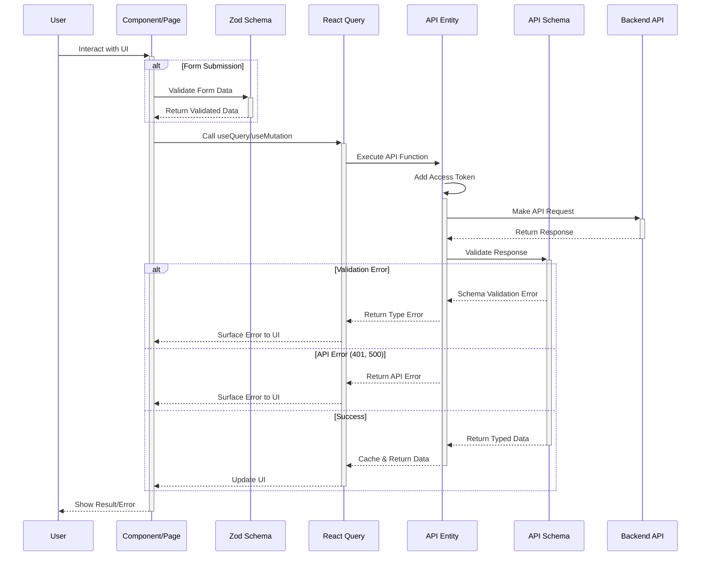

# Frontend Project

Zello frontend application is the user interface for my team work backend application built using C#, ASP.NET and PostgreSQL. The frontend application is developed using React, TypeScript, Tailwind, Shadcn, tanstack/react-query.

## Requirements / Features

## Frontend Goals

1. Implement enterprise integration with backend API 🌟
2. Focus on code quality, clean implementation and best practices 🌟
3. Implement proper state management on the front-end
4. Implement good and efficient UI/UX

## Frontend Architecture Overview

```mermaid
sequenceDiagram
participant UI as 🖥️ React UI
    participant Hook as 🪝 Custom Hooks
    participant Store as 🏪 Zustand Store
    participant Query as 🔄 TanStack Query
    participant Schema as ✅ Zod Schema
    participant Interceptor as 🔀 Axios Interceptors
    participant API as 🚀 Backend API

    Note over UI,API: Authentication Flow
    UI->>Store: Dispatch Login Action
    Store->>Schema: Validate Credentials
    Schema-->>Store: Validation Result
    Store->>Interceptor: Set Auth Headers
    Interceptor->>API: Login Request
    API-->>Store: JWT Token
    Store-->>UI: Update Auth State

    Note over UI,API: Data Flow
    UI->>Hook: Call Custom Hook
    Hook->>Query: Fetch Data
    Query->>Interceptor: HTTP Request
    Interceptor->>Interceptor: Add Auth Headers
    Interceptor->>API: Make API Call
    API-->>Interceptor: Response
    Interceptor->>Interceptor: Handle Response/Error
    Interceptor-->>Query: Processed Response
    Query->>Schema: Validate Response
    Schema-->>Query: Validated Data
    Query-->>Hook: Cached Data
    Hook-->>UI: Render Data

    Note over UI,API: Error Handling
    Interceptor->>Store: Global Error State
    Store-->>UI: Show Error Toast

    Note over UI,API: State Updates
    UI->>Store: Update Global State
    Store-->>Query: Invalidate Queries
    Query->>API: Refetch if needed
```

## API Integration Data Flow

